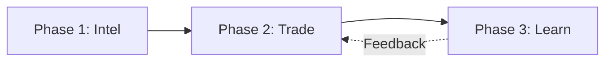
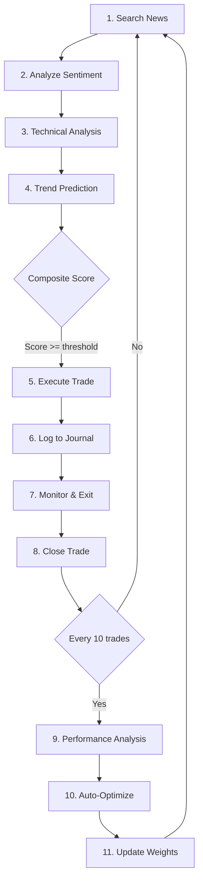

# Stock Market Skills

智能股票交易技能，包含市场监控、技术分析、AI走势预测和自动交易。

> [!CRITICAL] **SECURITY WARNING**
> **NEVER** print, log, or store API Keys in plain text (artifacts, logs, files).
> **ALWAYS** use environment variables or a secure vault.
> If an API Key is exposed, revoke it IMMEDIATELY.

## 📦 Dependencies

````bash
```bash
# One-time setup: Install dependencies
cd D:\MyProjects\Moltbot\MoltbotWorkspace\tools\stocks
uv sync
````

## 🚀 Alpaca Setup (Required - Trading & Data)

Alpaca provides **both market data and trading API** in one integration.

### Step 1: Create Account

1. Go to [Alpaca Signup](https://app.alpaca.markets/signup)
2. Create a free account (no minimum deposit for paper trading)

### Step 2: Get API Keys

1. Login to [Alpaca Dashboard](https://app.alpaca.markets/)
2. Go to **Paper Trading** → **API Keys** → **Generate New Key**
3. Copy your **API Key** and **Secret Key**

### Step 3: Set Environment Variables

Required environment variables:

- `ALPACA_API_KEY` - Your Alpaca API key
- `ALPACA_SECRET_KEY` - Your Alpaca secret key
- `ALPACA_PAPER` - Set to `true` for paper trading (default), `false` for live

(Managed via .env in workspace root or Gateway config)

---

## 🔄 Three-Phase Workflow

The trading system is organized into three independent phases:



### 📰 Phase 1: Intel (intel.py)

收集市场情报和新闻情感。**在开盘前或盘中按需运行。**

```powershell
# 收集情报
uv run --project D:\MyProjects\Moltbot\MoltbotWorkspace\tools\stocks python D:\MyProjects\Moltbot\MoltbotWorkspace\tools\stocks\intel.py gather NVDA PLTR

# 添加新闻文本并分析
uv run --project D:\MyProjects\Moltbot\MoltbotWorkspace\tools\stocks python D:\MyProjects\Moltbot\MoltbotWorkspace\tools\stocks\intel.py add AAPL "Apple stock surges after earnings"

# 查看缓存状态
uv run --project D:\MyProjects\Moltbot\MoltbotWorkspace\tools\stocks python D:\MyProjects\Moltbot\MoltbotWorkspace\tools\stocks\intel.py status
```

---

### 📊 Phase 2: Trade (trade.py)

技术分析、决策和交易执行。**在交易时段运行。**

```powershell
# 仅分析（不执行交易）
uv run --project D:\MyProjects\Moltbot\MoltbotWorkspace\tools\stocks python D:\MyProjects\Moltbot\MoltbotWorkspace\tools\stocks\trade.py analyze NVDA PLTR

# 分析并执行交易
uv run --project D:\MyProjects\Moltbot\MoltbotWorkspace\tools\stocks python D:\MyProjects\Moltbot\MoltbotWorkspace\tools\stocks\trade.py execute NVDA PLTR

# 查看交易状态
uv run --project D:\MyProjects\Moltbot\MoltbotWorkspace\tools\stocks python D:\MyProjects\Moltbot\MoltbotWorkspace\tools\stocks\trade.py status
```

---

### 📚 Phase 3: Learn (learn.py)

分析交易表现并优化策略。**在收盘后或每周运行。**

```powershell
# 性能分析
uv run --project D:\MyProjects\Moltbot\MoltbotWorkspace\tools\stocks python D:\MyProjects\Moltbot\MoltbotWorkspace\tools\stocks\learn.py analyze

# 自动优化策略
uv run --project D:\MyProjects\Moltbot\MoltbotWorkspace\tools\stocks python D:\MyProjects\Moltbot\MoltbotWorkspace\tools\stocks\learn.py optimize

# 生成报告
uv run --project D:\MyProjects\Moltbot\MoltbotWorkspace\tools\stocks python D:\MyProjects\Moltbot\MoltbotWorkspace\tools\stocks\learn.py report
```

---

## Legacy Tools

### 📊 alpaca_trade (Recommended)

Real market trading via Alpaca API. Supports both paper and live trading.

**Account & Positions:**

```powershell
. D:\MyProjects\Moltbot\MoltbotWorkspace\.env; uv run --project D:\MyProjects\Moltbot\MoltbotWorkspace\tools\stocks python D:\MyProjects\Moltbot\MoltbotWorkspace\tools\stocks\alpaca_trade.py account
. D:\MyProjects\Moltbot\MoltbotWorkspace\.env; uv run --project D:\MyProjects\Moltbot\MoltbotWorkspace\tools\stocks python D:\MyProjects\Moltbot\MoltbotWorkspace\tools\stocks\alpaca_trade.py positions
```

**Market Orders:**

```powershell
# Buy 10 shares of AAPL at market price
. D:\MyProjects\Moltbot\MoltbotWorkspace\.env; uv run --project D:\MyProjects\Moltbot\MoltbotWorkspace\tools\stocks python D:\MyProjects\Moltbot\MoltbotWorkspace\tools\stocks\alpaca_trade.py buy AAPL 10

# Sell 5 shares of AAPL at market price
. D:\MyProjects\Moltbot\MoltbotWorkspace\.env; uv run --project D:\MyProjects\Moltbot\MoltbotWorkspace\tools\stocks python D:\MyProjects\Moltbot\MoltbotWorkspace\tools\stocks\alpaca_trade.py sell AAPL 5
```

**Limit Orders:**

```powershell
# Buy 10 shares of AAPL at $180
. D:\MyProjects\Moltbot\MoltbotWorkspace\.env; uv run --project D:\MyProjects\Moltbot\MoltbotWorkspace\tools\stocks python D:\MyProjects\Moltbot\MoltbotWorkspace\tools\stocks\alpaca_trade.py limit_buy AAPL 180 10

# Sell 10 shares of AAPL at $200
. D:\MyProjects\Moltbot\MoltbotWorkspace\.env; uv run --project D:\MyProjects\Moltbot\MoltbotWorkspace\tools\stocks python D:\MyProjects\Moltbot\MoltbotWorkspace\tools\stocks\alpaca_trade.py limit_sell AAPL 200 10
```

**Order Management:**

```powershell
. D:\MyProjects\Moltbot\MoltbotWorkspace\.env; uv run --project D:\MyProjects\Moltbot\MoltbotWorkspace\tools\stocks python D:\MyProjects\Moltbot\MoltbotWorkspace\tools\stocks\alpaca_trade.py orders
. D:\MyProjects\Moltbot\MoltbotWorkspace\.env; uv run --project D:\MyProjects\Moltbot\MoltbotWorkspace\tools\stocks python D:\MyProjects\Moltbot\MoltbotWorkspace\tools\stocks\alpaca_trade.py cancel <ORDER_ID>
. D:\MyProjects\Moltbot\MoltbotWorkspace\.env; uv run --project D:\MyProjects\Moltbot\MoltbotWorkspace\tools\stocks python D:\MyProjects\Moltbot\MoltbotWorkspace\tools\stocks\alpaca_trade.py cancel_all
```

---

### 📈 stock_analyze (Enhanced)

技术分析 + AI预测综合评估。返回 `VERDICT` (STRONG_BUY, BUY, NEUTRAL, SELL, STRONG_SELL)。

**基础分析:**

```powershell
$env:ALPHAVANTAGE_API_KEY="<YOUR_KEY>"; uv run --project D:\MyProjects\Moltbot\MoltbotWorkspace\tools\stocks python D:\MyProjects\Moltbot\MoltbotWorkspace\tools\stocks\analyze.py <SYMBOL>
```

**增强分析 (含趋势预测):**

```powershell
$env:ALPHAVANTAGE_API_KEY="<YOUR_KEY>"; uv run --project D:\MyProjects\Moltbot\MoltbotWorkspace\tools\stocks python D:\MyProjects\Moltbot\MoltbotWorkspace\tools\stocks\analyze.py <SYMBOL> --enhanced
```

**JSON输出 (供Agent解析):**

```powershell
$env:ALPHAVANTAGE_API_KEY="<YOUR_KEY>"; python D:\MyProjects\Moltbot\MoltbotWorkspace\tools\stocks\analyze.py <SYMBOL> --json
```

---

### 🔮 trend_predict (NEW)

使用机器学习预测5日价格走势 (UP/DOWN/FLAT)。

```powershell
# 预测趋势
$env:ALPHAVANTAGE_API_KEY="<YOUR_KEY>"; uv run --project D:\MyProjects\Moltbot\MoltbotWorkspace\tools\stocks python D:\MyProjects\Moltbot\MoltbotWorkspace\tools\stocks\trend_predict.py predict <SYMBOL>

# 回测验证
$env:ALPHAVANTAGE_API_KEY="<YOUR_KEY>"; uv run --project D:\MyProjects\Moltbot\MoltbotWorkspace\tools\stocks python D:\MyProjects\Moltbot\MoltbotWorkspace\tools\stocks\trend_predict.py backtest <SYMBOL>
```

输出示例:

```json
{
  "symbol": "AAPL",
  "direction": "UP",
  "confidence": 0.62,
  "probabilities": { "DOWN": 0.18, "FLAT": 0.2, "UP": 0.62 },
  "method": "gradient_boosting",
  "horizon_days": 5
}
```

> [!WARNING]
> 趋势预测仅供参考，不能保证准确性。请结合技术分析综合判断。

---

### 📰 news_intel (NEW)

新闻情报收集和情感分析。

**情感分析:**

```powershell
python D:\MyProjects\Moltbot\MoltbotWorkspace\tools\stocks\news_intel.py sentiment "Apple stock surges after strong earnings report"
```

**事件检测:**

```powershell
python D:\MyProjects\Moltbot\MoltbotWorkspace\tools\stocks\news_intel.py events "Apple announces merger with Tesla"
```

**Agent工作流 (使用 Brave Search):**

1. Agent 使用 **Brave Search** 搜索 `"{SYMBOL} stock news today"`
2. Agent 调用 `news_intel.py sentiment` 分析新闻情感
3. Agent 将情感得分整合到交易决策中

---

### 🤖 decision (NEW - 灵活决策引擎)

智能决策模块，提供自适应策略和灵活仓位管理。

**做出交易决策:**

```powershell
python D:\MyProjects\Moltbot\MoltbotWorkspace\tools\stocks\decision.py decide <SYMBOL>

# JSON输出
python D:\MyProjects\Moltbot\MoltbotWorkspace\tools\stocks\decision.py decide <SYMBOL> --json
```

**检测市场状态:**

```powershell
python D:\MyProjects\Moltbot\MoltbotWorkspace\tools\stocks\decision.py regime --vix=25
```

**计算动态仓位:**

```powershell
# 参数: 信号得分, 波动率
python D:\MyProjects\Moltbot\MoltbotWorkspace\tools\stocks\decision.py sizing 5.5 0.025
```

**生成多级出场计划:**

```powershell
# 参数: 入场价格, 方向(LONG/SHORT)
python D:\MyProjects\Moltbot\MoltbotWorkspace\tools\stocks\decision.py exit 150.00 LONG
```

**核心功能:**

| 功能       | 说明                                                        |
| ---------- | ----------------------------------------------------------- |
| 自适应策略 | 根据胜率和市场状态自动切换 aggressive/balanced/conservative |
| 动态仓位   | 根据信号强度、波动率、胜率调整仓位 (2%-25%)                 |
| 连亏保护   | 连续3次亏损后自动减半仓位                                   |
| 多级止盈   | TP1(33%) → 移动止损 → TP2(33%) → TP3(剩余)                  |
| 市场状态   | 识别 BULL/BEAR/HIGH_VOL/LOW_VOL 并调整参数                  |

---

### 📊 stock_chart

生成K线图 (含 MA50/MA200 和成交量)。

```powershell
$env:ALPHAVANTAGE_API_KEY="<YOUR_KEY>"; uv run --project D:\MyProjects\Moltbot\MoltbotWorkspace\tools\stocks python D:\MyProjects\Moltbot\MoltbotWorkspace\tools\stocks\chart.py <SYMBOL> <OUTPUT_PATH>
```

---

## 🛡️ Risk Circuit Breaker (Panic Button)

**EMERGENCY PROTOCOL**: If any of these conditions are met, **STOP TRADING IMMEDIATELY** and notify the user.

1. **Daily Loss Limit**: Portfolio value drops **> 5%** in a single session.
2. **Consecutive API Errors**: 5+ API errors in a row (indicates connection/auth issues).
3. **Abnormal Volatility**: VIX Index > 35 (extreme fear).

**Action**:

- Cancel all open orders: `alpaca_trade.py cancel_all`
- Send High-Priority Notification: "🚨 CIRCUIT BREAKER TRIGGERED: [Reason]. Trading halted."

---

## 📊 Trading Strategies

Choose a strategy based on risk tolerance. Combine with `stock_analyze` verdicts.

### 🔥 Aggressive — Momentum Breakout Strategy

**Entry Conditions (ALL must be true):**

- VERDICT = BUY or STRONG_BUY
- RSI between 40-70 (momentum zone)
- MACD > Signal AND histogram increasing 2+ days
- Price > 20-day SMA
- Volume > 1.5x 20-day average

**Exit Rules:**
| Condition | Action |
|-----------|--------|
| Price drops 8% from entry | **STOP LOSS** |
| RSI > 80 | Take 50% profit |
| MACD crosses below signal | Exit remaining |
| Price hits +20% | Trailing stop at 10% below high |

---

### ⚖️ Balanced — Multi-Signal Confirmation (Recommended)

**Entry Conditions (Score-based, need ≥4 points):**
| Signal | Points |
|--------|--------|
| VERDICT = STRONG_BUY | +2 |
| VERDICT = BUY | +1 |
| RSI crossing above 30 | +2 |
| MACD golden cross | +2 |
| Trend prediction = UP (≥55% confidence) | +1 |
| News sentiment = BULLISH (≥60% confidence) | +1 |
| Volume spike > 2x average | +1 |

**Exit Rules:**
| Condition | Action |
|-----------|--------|
| Score drops to ≤1 | Exit 100% |
| Price drops 5% from entry | **STOP LOSS** |
| RSI > 70 | Exit 33% |
| VERDICT = STRONG_SELL | Exit 100% |

---

### 🛡️ Conservative — Value + Trend Alignment

**Pre-Qualification:**

- Market cap > $50B (large-cap only)
- In S&P 500 or NASDAQ-100
- Price > 200-day SMA

**Entry:** VERDICT = STRONG_BUY AND RSI < 30 AND Trend prediction = UP

**Exit:** 3% stop loss, strict rules only

---

## 📈 Strategy Selection Guide

| Your Profile                | Strategy        | Expected Annual Return | Max Drawdown |
| --------------------------- | --------------- | ---------------------- | ------------ |
| High risk tolerance, active | 🔥 Aggressive   | 20-40%                 | -25%         |
| Moderate risk, weekly check | ⚖️ Balanced     | 12-20%                 | -15%         |
| Capital preservation        | 🛡️ Conservative | 8-12%                  | -8%          |

---

## 🧠 Self-Learning System

### trade_journal

记录所有交易用于分析。

```powershell
# Log a new trade
python D:\MyProjects\Moltbot\MoltbotWorkspace\tools\stocks\trade_journal.py log AAPL BUY 10 150.00 balanced "RSI=28,MACD_cross" "Oversold bounce"

# Close a trade
python D:\MyProjects\Moltbot\MoltbotWorkspace\tools\stocks\trade_journal.py close 1 165.00 "Take profit +10%"

# View trades
python D:\MyProjects\Moltbot\MoltbotWorkspace\tools\stocks\trade_journal.py list
```

---

### performance (Enhanced)

分析交易表现并自动优化策略参数。新增风险调整指标。

```powershell
# Full analysis with Sharpe/Calmar ratios
python D:\MyProjects\Moltbot\MoltbotWorkspace\tools\stocks\performance.py analyze

# Get improvement suggestions
python D:\MyProjects\Moltbot\MoltbotWorkspace\tools\stocks\performance.py suggest

# Auto-optimize: adjusts parameters AND signal weights
python D:\MyProjects\Moltbot\MoltbotWorkspace\tools\stocks\performance.py optimize

# Update signal weights based on historical performance
python D:\MyProjects\Moltbot\MoltbotWorkspace\tools\stocks\performance.py weights

# View current config
python D:\MyProjects\Moltbot\MoltbotWorkspace\tools\stocks\performance.py config
```

---

### strategy_config.json

可调节的策略参数。Agent 应在交易前读取，优化后更新。

**新增参数:**

- `news_sentiment.enabled` - 是否启用新闻情感分析
- `news_sentiment.weight` - 情感对综合评分的权重
- `trend_prediction.enabled` - 是否启用趋势预测
- `trend_prediction.min_confidence` - 最低预测置信度
- `weights.*` - 各信号的动态权重 (由 performance.py optimize 自动调整)

---

## 🔄 Enhanced Learning Workflow



**Agent Instructions:**

1. **Before every trade**:
   - Search news with `search_web` → analyze with `news_intel.py`
   - Run `analyze.py --enhanced` for composite score
   - Read `strategy_config.json` for current parameters
2. **After every trade**: Log entry in `trade_journal.py`
3. **When closing**: Record exit price and reason
4. **Every 10 trades**: Run `performance.py optimize` to improve
5. **If win rate < 40%**: Switch to more conservative strategy
6. **If Sharpe ratio < 0.3**: Reduce position sizes

---

## Notes

| Service       | Rate Limit | Cost                   |
| ------------- | ---------- | ---------------------- |
| Alpha Vantage | 25 req/day | Free                   |
| Alpaca Paper  | Unlimited  | Free                   |
| Alpaca Live   | Unlimited  | Free (commission-free) |

- Get Alpha Vantage key: [alphavantage.co](https://www.alphavantage.co/support/#api-key)
- Alpaca supports US stocks only (NYSE, NASDAQ)
